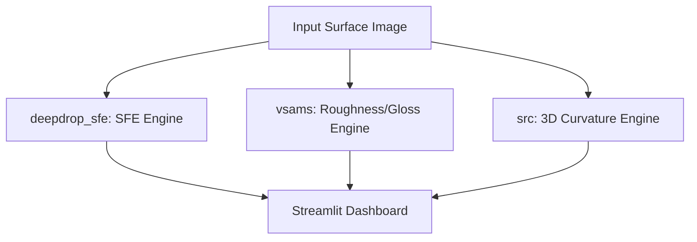
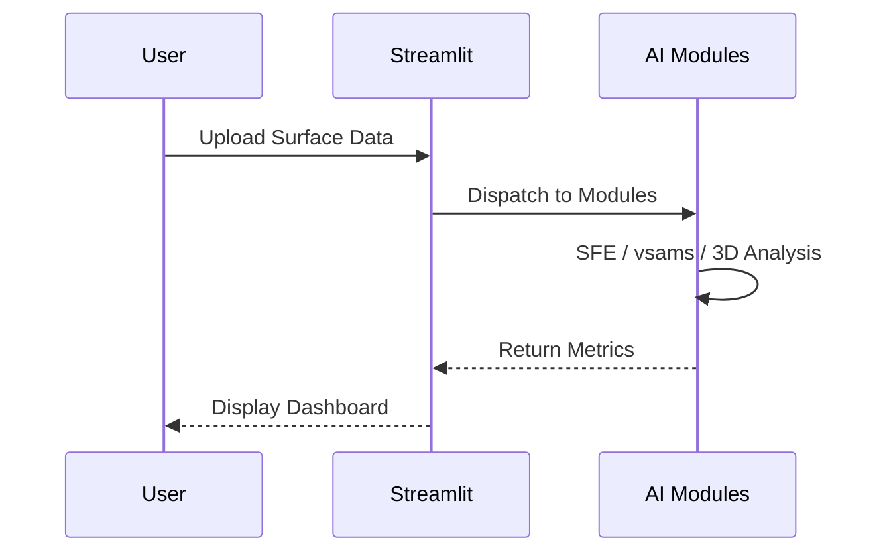

# 통합 표면 분석 플랫폼 (Integrated Surface Analysis Platform)

   

라이브 데모 배포 주소: [https://sg-integration-2-3-7.streamlit.app/](https://sg-integration-2-3-7.streamlit.app/)

본 프로젝트는 표면 자유 에너지(SFE) 분석, 표면 마감 상태(조도/광택도) 평가, 3D 지형 및 곡률 분석 기능을 하나의 인터페이스로 제공하는 통합 제어 솔루션입니다.

## Technical Architecture & Workflow

### Architecture Diagram

### Sequence Diagram



## 아키텍처 및 구성

프로젝트는 다음의 구조로 결합되어 구동됩니다:

- deepdrop_sfe: SFE 측정을 담당하며, 2개 액체의 접촉각 및 OWRK 계산을 수행합니다.
- vsams: 금속 표면의 동전 반사상을 기반으로 조도(Ra), 광택도, 마감 유형을 분석합니다.
- src: 3D 심도 및 곡률 연산(가우시안 곡률 K 및 최소 곡률 반경 R)을 담당합니다.
- app.py: 전체 기능을 통합 탭 레이아웃 및 다국어 지원으로 시각화하는 Streamlit 메인 대시보드입니다.

## 구동 요구 사항

- Python 3.10.6 이상
- CUDA 12.x 및 NVIDIA GPU 환경 (RTX 5080 가속 대응)
- 추가 패키지 의존성 (requirements.txt 명세)

## 모델 가중치 자동 다운로드 및 무결성 검증

본 시스템은 Hugging Face Hub 연동 파이프라인을 구축하여, 사용자가 번거롭게 가중치를 수동으로 다운로드할 필요가 없습니다.
앱 초기화 시(`_load_engines()`), 필요한 파일들의 존재 여부 및 MD5 체크섬을 검사하고, 누락된 가중치들은 자동으로 다운로드됩니다.

- Depth-Anything-V2 모델: `depth-anything/Depth-Anything-V2-Small` (HF 공식 저장소)
- 기타 Custom 가중치 (SAM2, V-SAMS, MobileSAM): `chemahc94/sg-weights` (사설 저장소)

네트워크 보안 정책으로 인해 다운로드가 차단된 오프라인 환경인 경우, 사전에 다운로드하여 `checkpoints/`, `models/`, `vsams/data/` 경로에 배치해야 합니다.

## 실행 방법

### 1. 로컬 환경으로 구동 시

프로젝트 루트 디렉토리에서 가상환경을 생성 및 활성화한 후, 필수 패키지를 설치하고 실행합니다.

```bash
# 가상환경 생성 및 활성화 (Windows)
python -m venv .venv
.venv\Scripts\activate

# 패키지 설치
pip install -r requirements.txt

# 앱 실행
streamlit run app.py
```

### 2. Docker를 이용한 컨테이너 구동 시

Docker 및 NVIDIA Container Toolkit이 설치되어 있는 경우 다음 명령어로 GPU 가속 기반 실행을 지원합니다.

빌드 및 구동 명령어:
docker compose up --build -d

포트 8501을 통해 웹 브라우저에서 대시보드에 접근할 수 있습니다.

## CI/CD 파이프라인

본 프로젝트는 GitHub Actions를 활용한 지속적 통합(CI) 및 지속적 제공(CD) 파이프라인이 구성되어 있습니다.

### 1. 주요 워크플로우 구성 (.github/workflows/ci.yml)

- **코드 품질 및 구문 확인 (Lint & Import Test)**: 코드 푸시 또는 풀 리퀘스트 생성 시 ruff 검사 및 pytest를 통한 핵심 모듈 임포트 결합 테스트를 자동으로 수행합니다.
- **도커 빌드 검증 (Docker Build Validation)**: Dockerfile이 오류 없이 정상 빌드되는지 임시 빌드를 통해 검증합니다.
- **자동 이미지 배포 (Docker Image CD)**: main 또는 master 브랜치에 코드가 병합될 때 GitHub Container Registry (GHCR)에 최신 이미지를 자동 빌드 및 배포하도록 설계되어 있습니다. (기본적으로 비활성화 상태이며 주석을 해제하여 활성화합니다.)

### 2. CD 파이프라인 활성화 및 가이드

자동 배포 기능을 사용하려면 GitHub 저장소에서 다음 설정을 완료해야 합니다.

1. **워크플로우 주석 해제**:
   - .github/workflows/ci.yml 파일 하단의 deploy-ghcr 작업 부분 주석을 해제합니다.
2. **저장소 권한 설정**:
   - GitHub 저장소 설정 (Settings) > Actions > General > Workflow permissions 항목으로 이동합니다.
   - Read and write permissions 옵션을 활성화하여 워크플로우가 GHCR에 패키지를 생성 및 푸시할 수 있도록 권한을 설정합니다.
3. **이미지 확인**:
   - 성공적으로 푸시된 도커 이미지는 GitHub 프로필 또는 조직의 Packages 탭에서 확인 및 내려받기(pull)할 수 있습니다.

## ☁️ Streamlit Cloud 배포 및 OOM 방어 가이드

이 애플리케이션은 내부적으로 SAM 2.1 및 Depth-Anything-V2와 같은 고중량 모델을 가동합니다. 무료 Streamlit Cloud와 같은 제한된 환경(1~2GB RAM)에서의 크래시(OOM, ConnectionClosedError 1011)를 방어하기 위해 다음과 같은 로직이 코어에 내장되어 있습니다.

- **입력 해상도 방어**: 사용자가 고해상도 이미지를 업로드하더라도 엔진 내부에서 최대 800px로 강제 Downscaling 처리.
- **가비지 컬렉션(GC)**: 매 상호작용 및 이미지 렌더링 시 명시적인 `gc.collect()` 가동.
- **단일 스레딩**: `torch.set_num_threads(1)`을 적용하여 급격한 스레드 스파이크 및 자원 고갈 차단.

**⚠️ 필수 보안 설정 (Secrets):**
앱 구동 시 사설 Hugging Face 저장소(`chemahc94/sg-weights`)로부터 가중치를 받아오기 위해서는 반드시 Streamlit 대시보드(App settings > Secrets)에 접근 토큰을 명시해야 합니다.
```toml
HF_TOKEN = "hf_본인의_허깅페이스_토큰_입력"
```
