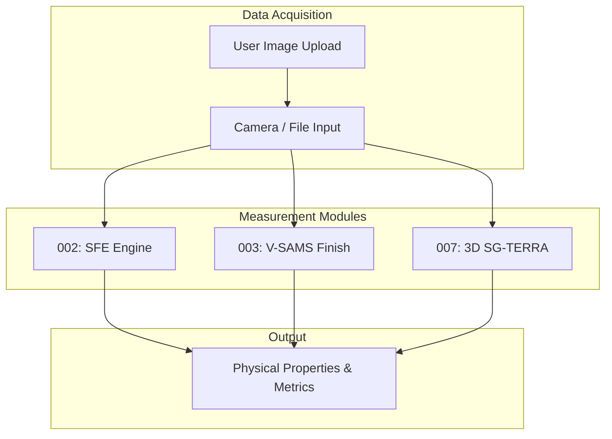

# 통합 표면 분석 플랫폼 - Step 1: 계측 (SG_integration_step1)

   

## 1. 개요
표면 자유 에너지(SFE) 분석, 표면 마감 상태 평가, 3D 지형 및 곡률 분석 기능을 하나의 인터페이스로 제공하는 통합 계측 플랫폼입니다. 파이프라인의 첫 번째 단계(Step 1)로서, 사용자가 입력한 이미지로부터 핵심 물리량을 추출하여 다음 의사결정 모듈로 전달합니다.

## 2. 주요 개선 사항 (v1.1 업데이트)
- [오염 판별 폴백 개편]: anomaly_eng 모델 로드에 실패하거나 GPU 자원 부족으로 None이 될 때 가짜 오염 스코어(0.62)를 출력해 은폐하던 더미 로직을 제거하고, 모델 부재 시 STEP 5 오염 판정 단계에서 경고창 출력 후 안전하게 바이패스하도록 예외 처리 구조를 재설계했습니다.
- [원근 보정 실시간 정합]: Homography 계산 기반의 원근 왜곡 보정과 SAM 2 액적 윤곽 원형도 검증 알고리즘을 도입하여 노이즈 영역에 대한 계측 왜곡을 원천 제어합니다.

## 3. 아키텍처 다이어그램


## 4. 주요 포함 모듈 (Git Submodule)
- SG_proj_002: OWRK 모델 기반 표면 에너지 산출
- SG_proj_003: 동전 반사상을 활용한 표면 마감 및 거칠기 판별 (SurfaceEvaluator)
- SG_proj_007: Depth-Anything-V2 기반 3D 형상 복원 및 평균 이웃 곡률 계산

## 5. 실행 방법
```bash
git submodule update --init --recursive
pip install -r requirements.txt
streamlit run app.py
```


## 최신 업데이트 내역 (2026-06-29)
- 초기 기동 및 디버깅 시 강제 주입되던 0.62 오염도 모의 스코어를 제거하고, 비초기화 모델에 대한 Warning 안전 우회 분기(Fallback) 구현.
