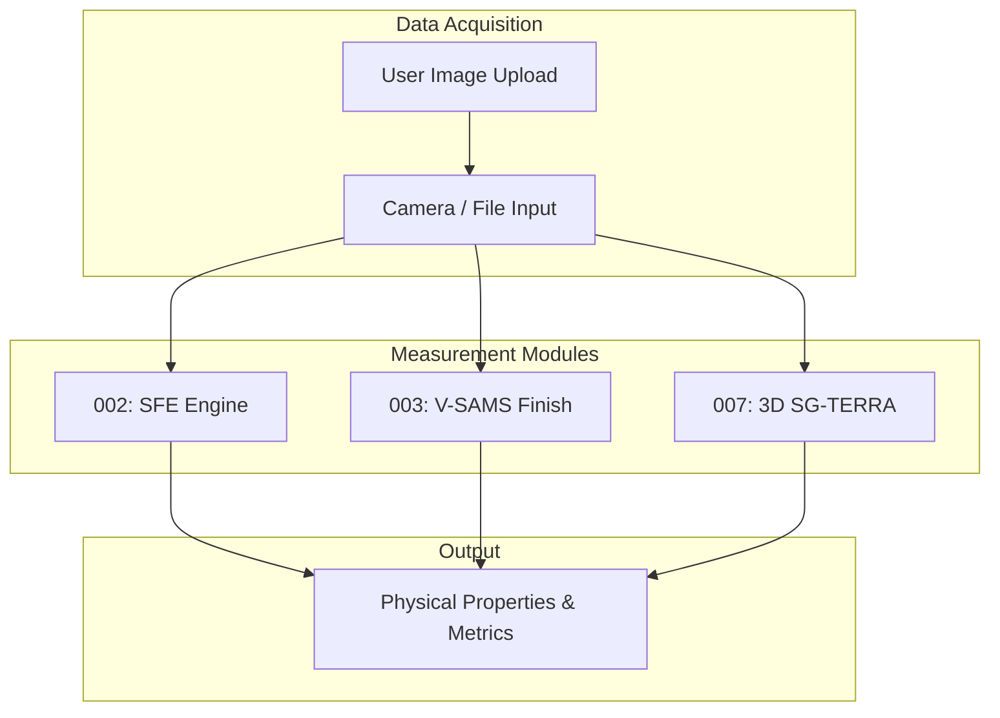

# 통합 표면 분석 플랫폼 - Step 1: 계측 (SG_integration_step1)


## 1. 개요
표면 자유 에너지(SFE) 분석, 표면 마감 상태 평가, 3D 지형 및 곡률 분석 기능을 하나의 인터페이스로 제공하는 통합 계측 플랫폼입니다. 파이프라인의 첫 번째 단계(Step 1)로서, 사용자가 입력한 이미지로부터 핵심 물리량을 추출하여 다음 의사결정 모듈로 전달합니다.

## 2. 아키텍처 다이어그램


## 3. 주요 포함 모듈 (Git Submodule)
- **SG_proj_002**: OWRK 모델 기반 표면 에너지 산출
- **SG_proj_003**: 동전 반사상을 활용한 표면 마감 및 거칠기 판별
- **SG_proj_007**: Depth-Anything-V2 기반 3D 형상 복원 및 곡률 계산

## 4. 실행 방법
```bash
git submodule update --init --recursive
pip install -r requirements.txt
streamlit run app.py
```
